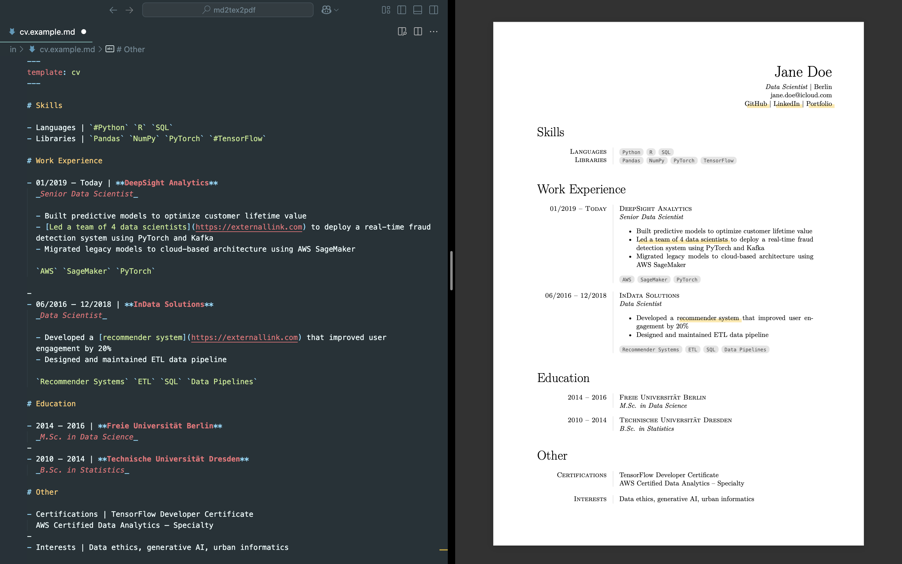

# md2pdf

Create PDF documents from Markdown using LaTeX or Typst templates



## Requirements

[Pandoc](https://pandoc.org) for text conversion, [fswatch](https://emcrisostomo.github.io/fswatch/) for the watch script.

Installation on macOS using [Homebrew](https://brew.sh):

```sh
brew install pandoc fswatch
```

Also, you must have installed a typesetting engine:

- [LaTeX](https://www.tug.org/texlive/) for `.tex` templates
- [Typst](https://github.com/typst/typst) for `.typ` templates

## Installation

```sh
./run/install.sh
```

This will create a `md2pdf` bash script in your `~/.local/bin/` folder and make it available as a global command (assuming `~/.local/bin/` is in your `PATH`).

> In case you move the `md2pdf` folder to another location later you should re-run the install command.

## Usage

```sh
md2pdf
```

This starts the watch script: Any change of `.md` files in the current directory will trigger recompilation.

Or compile a file manually:

```sh
md2pdf [--raw] yourfile.md
```

The generated `.pdf` file will be saved in directory of the source file. If the command is run with a `--raw` flag, the output will be a `.tex` or a `.typ` file, depending on the used template.

## Configuration

Copy `config.example.yaml` to `config.yaml` and edit the variables that are being used in the templates (name, email, websites, ...).

> Note that `*.md` files in the `example` folder will always use `config.example.yaml`.

In your Markdown files, you can extend or overwrite them using a YAML front matter block:

```
---
template: cv.tex      # or "letter.tex" or any other template that you have in your /templates/ folder
link_color: e8a9ff    # hex code for custom link color in this document
---
```

## Extras

Inline code (backtick-enclosed) will be rendered as tags (see [cv.example.pdf](out/cv.example.pdf)). If you add a hash before and you have specified a `tag_base_url` variable, it will also get a link (e.g, `https://yourwebsite.com/portfolio?tag={tag_name}`):

```
  Skills: `HTML` `CSS` `#JavaScript`
```
